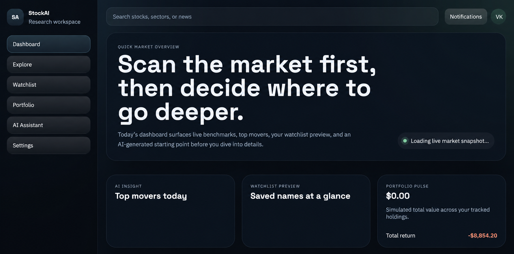

# StockAI — Stock Analytics Platform

StockAI is a full-stack stock research workspace that combines live market data, portfolio-style analytics, watchlists, visual comparisons, and a streaming AI research assistant in one dashboard.

The application uses Yahoo Finance for market and company data. Its AI assistant is built with LangChain and a tool-enabled GPT model that can retrieve prices, historical data, balance sheets, and stock news while answering questions.

> StockAI is an educational research project. It does not provide financial advice, and market data may be delayed or incomplete.



## Features

### Market dashboard

- Live snapshots for the S&P 500 (`SPY`), Nasdaq 100 (`QQQ`), Dow Jones (`DIA`), and Russell 2000 (`IWM`)
- Current price and daily percentage change for selected companies
- Top-mover ranking based on absolute daily movement
- Watchlist and simulated portfolio summaries
- Six-month multi-stock price comparison with return calculations
- Focus-stock metrics including P/E ratio, market capitalization, and analyst recommendation
- Automatic market-data refresh every 60 seconds

### Stock discovery

- Search the supported universe by ticker or company name
- Browse price and daily-momentum cards
- Add and remove companies from the session watchlist
- Momentum heatmap for quickly comparing positive and negative daily moves
- Select up to four stocks as the active research context

The current supported universe is:

| Ticker | Company |
| --- | --- |
| AAPL | Apple |
| MSFT | Microsoft |
| NVDA | NVIDIA |
| AMZN | Amazon |
| GOOGL | Alphabet |
| META | Meta |
| TSLA | Tesla |
| JPM | JPMorgan Chase |

### Watchlist

- Track saved companies in a live price table
- View price and daily movement at a glance
- Promote a company into the active comparison set
- Open the comparison view or start a ticker-specific AI analysis

Watchlist changes are currently kept in browser memory and reset when the page reloads.

### Portfolio analytics

- Simulated holdings, market value, cost basis, and profit/loss
- Total portfolio value and aggregate profit/loss
- Allocation breakdown by holding
- What-if calculation showing how many shares a $5,000 investment could purchase

Portfolio holdings are sample data defined in the frontend; the application does not yet support brokerage connections or persistent portfolio editing.

### AI research assistant

- Streaming chat responses in the browser
- Conversation memory scoped to the current browser session
- Suggested prompts for valuation, risk, catalysts, comparisons, and long-term investment theses
- Dashboard-selected tickers passed into the visible research context
- Tool access for:
  - Current stock prices
  - Historical price data
  - Balance sheets
  - Company news

### Interface

- Dedicated Dashboard, Explore, Watchlist, Portfolio, AI Assistant, and Settings views
- Responsive dark dashboard layout
- Loading and API error states
- Settings controls for theme, currency, and notifications

The settings controls currently demonstrate UI state only. Currency conversion, persistent preferences, notifications, and a light theme are not yet implemented.

## Tech stack

| Layer | Technologies |
| --- | --- |
| Frontend | React 19, TypeScript, Vite, CSS |
| Backend | Python 3.13, FastAPI, Uvicorn, Pydantic |
| AI | LangChain, LangGraph in-memory checkpoints, OpenAI-compatible chat model |
| Market data | `yfinance` / Yahoo Finance |
| Package management | npm and uv |

## Project structure

```text
Stock-Analytics-Platform/
├── backend/
│   ├── main.py          # FastAPI endpoints, market-data logic, and AI agent
│   ├── pyproject.toml   # Python project and dependencies
│   └── uv.lock          # Locked Python dependencies
├── docs/
│   └── assets/          # README screenshots and documentation assets
├── frontend/
│   ├── src/
│   │   ├── App.tsx      # Application views and client-side behavior
│   │   └── App.css      # Dashboard styles
│   ├── package.json     # Frontend scripts and dependencies
│   └── vite.config.ts   # Dev server and /api proxy
└── README.md
```

## Prerequisites

- Python 3.13
- [uv](https://docs.astral.sh/uv/)
- Node.js and npm
- An API key accepted by the OpenAI-compatible endpoint configured in `backend/main.py`

## Getting started

### 1. Configure the backend

Create `backend/.env` if it does not already exist:

```env
OPENAI_API_KEY=your_api_key_here
```

The dashboard endpoint can retrieve market data without this key, but AI chat requires it.

Install the locked backend dependencies and start the FastAPI development server:

```bash
cd backend
uv sync
uv run uvicorn main:app --host 0.0.0.0 --port 8888 --reload
```

The backend will be available at `http://localhost:8888`. Interactive API documentation is available at `http://localhost:8888/docs`.

### 2. Start the frontend

In a second terminal:

```bash
cd frontend
npm install
npm run dev
```

Open `http://localhost:3000` in your browser.

During development, Vite proxies requests from `/api` to `http://localhost:8888`, so both servers must be running for the complete experience.

## API

### `GET /api/dashboard`

Returns company snapshots, benchmark data, price history, news, and computed insights for up to four supported tickers.

Example:

```bash
curl "http://localhost:8888/api/dashboard?tickers=AAPL,MSFT,NVDA,AMZN"
```

Unsupported tickers are ignored. If no supported ticker remains, the endpoint uses `AAPL`, `MSFT`, `NVDA`, and `AMZN`.

### `POST /api/chat`

Streams a plain-text response from the stock research agent.

Example:

```bash
curl -N -X POST "http://localhost:8888/api/chat" \
  -H "Content-Type: application/json" \
  -d '{
    "prompt": {
      "content": "Compare AAPL and MSFT on valuation and risk.",
      "id": "prompt-1",
      "role": "user"
    },
    "threadId": "research-session-1",
    "responseId": "response-1"
  }'
```

The `threadId` identifies an in-memory conversation. Conversation state is lost when the backend restarts.

## Development commands

Frontend commands, run from `frontend/`:

```bash
npm run dev      # Start the Vite development server
npm run build    # Type-check and create a production build
npm run lint     # Run ESLint
npm run preview  # Preview the production build locally
```

Backend commands, run from `backend/`:

```bash
uv sync
uv run python main.py
```

Running `main.py` starts Uvicorn on `0.0.0.0:8888` without automatic reload.

## Current limitations

- The company universe is fixed in the backend.
- Watchlists, settings, chat memory, and selected tickers are not persisted.
- Portfolio holdings are hard-coded sample data.
- Sector filter chips are presentational and do not currently filter results.
- Settings do not yet apply currency conversion, notifications, or light mode.
- The backend allows all CORS origins, which should be restricted before production use.
- Yahoo Finance is an external data source and can occasionally return missing fields or temporary errors.

## Production notes

Before deploying, consider adding persistent storage, authentication, request rate limiting, stricter CORS configuration, secret management, API error retries, and a configurable frontend API base URL. Build the frontend with `npm run build` and serve the generated `frontend/dist` assets through a static host or web server.
